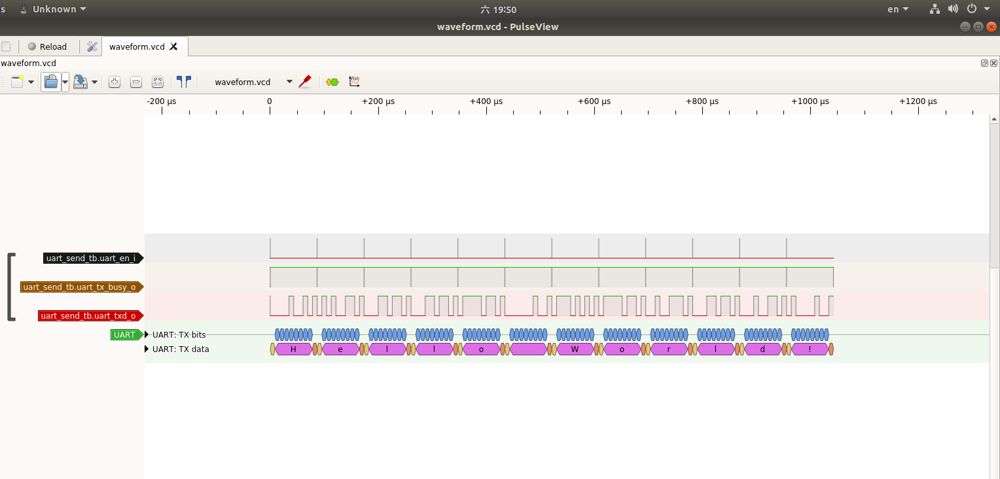

# Introduction
By using pulseview software to import the vcd waveform file generated by testbench and inserting the decoder, it is easy to verify the correctness of the interface logic of the written code. A simple example of serial port sending is shown below.

This repository holds the design source code for decoding protocols using pulseview and testbench for joint verilog simulation design, including vcs version and modelsim version.
# How to use?
The specific pulseview download and installation, testbench writing and simulation process are described in detail in the tutorial:

https://github.com/ITANGTANGI/verilog_decoder_pulseview/blob/main/tutorial/tutorial(Chinese).md

Video version of the tutorial: in production
