# 简介
经常使用RTL例如verilog进行数字逻辑设计的朋友，仿真一定是一个绕不开的话题。在一些标准的数字接口和协议上，使用仿真软件例如modelsim或者vcs进行仿真后，得到的都是波形文件，使用相应的波形查看器查看数字信号的变化以确认协议逻辑设计的正确性，这点一般需要凭借个人丰富的经验和对协议的充分理解才能保证。可谓是“人脑解码器”，效率低下且很容易出错。例如下图中的串行发送数据不经解码很难确认正确性。
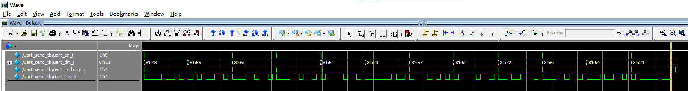

市面上一些逻辑分析仪配套软件例如DSview或是pulseview拥有庞大的数字协议解码器库，配合逻辑分析仪使用时能够快速分析设计正确性，但这样一般又都需要逻辑分析仪硬件设备以及数字逻辑设计的实现载体例如FPGA等，也很不方便。

经过研究，逻辑分析仪软件例如pulseview能够通过导入其他格式波形（例如vcd）文件，再对相应通道添加解码器，即可实现仿真+解码验证的全套软件实现流程，不需要借助硬件进行分析，并且也不需要靠人工去分析协议的正确性，十分方便。

例如上图中的波形导出vcd文件后由pulseview软件导入并添加串口解码器后得到如下图所示的结果，可以看到串口协议设计正确且发送的数据十分清晰被解码出来。
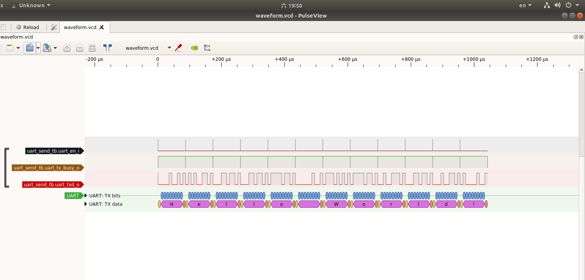

# 软件和波形文件格式
Pulseview是一款开源的逻辑分析仪软件，具有十分漂亮的界面和强大的解码库，支持Windows，Linus，MacOS等多个平台，可以通过导入波形文件进行解码和分析，具体介绍可以查看官方Wiki。

VCD （Value Change Dump）是一个通用的格式。 VCD文件是IEEE1364标准(Verilog HDL语言标准)中定义的一种ASCII文件。它主要包含了头信息，变量的预定义和变量值的变化信息。正是因为它包含了信号的变化信息，就相当于记录了整个仿真的信息，我们可以用这个文件来再现仿真，也就能够显示波形。

本次的教程即通过逻辑分析仪配套软件pulseview读取vcd文件进行解码。

# 使用过程
参考Verilog和Testbench设计源码在github： https://github.com/ITANGTANGI/verilog_decoder_pulseview

本次教程分为Windows端和Linux端两个部分。
## Windows平台
### 软件安装
首先到官网  https://sigrok.org/wiki/Downloads  如下图所示，根据电脑的配置下载Windows安装包，已经使用过sigrok兼容的逻辑分析仪的话应该电脑中都有pulseview软件了。
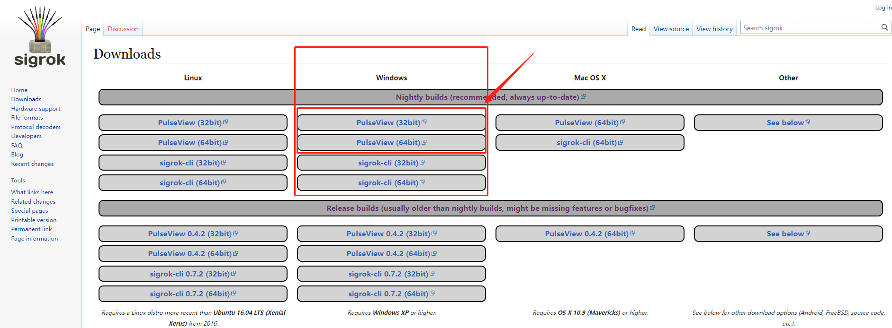

下载完成后双击安装包，按照正常软件安装步骤正常安装即可，没有啥需要注意的。如下图所示就是安装按成了。
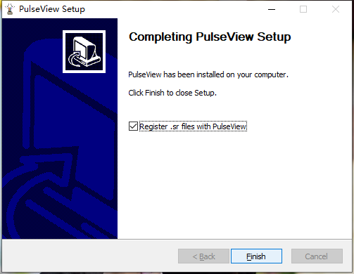

安装完成后不会生成快捷方式，在“开始”菜单栏中找到如下图所示的sigrok文件夹中pulseview打开或自行添加快捷方式即可。
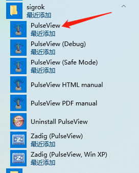

至此软件安装完成。
### vcd波形文件生成
因为VCD是 Verilog HDL语言标准的一部分，因此所有的verilog的仿真器都要能够实现这个功能，也要允许用户在verilog代码中通过系统函数来dump VCD文件。我们可以通过Verilog HDL的系统函数dumpfile来生成波形，通过dumpvars的参数来规定我们抽取仿真中某些特定模块和信号的数据。

#### 基础波形生成和导入显示操作
如下例代码中添加的一个initial块，里面使用dumpfile生成了waveform.vcd文件，并把clk_i和data_i信号添加进波形文件的变量中。

样例代码：
```verilog
`timescale  1ns / 1ps

module vitual_logic_decoder_tb;

// vitual_logic_analyzer Parameters
parameter PERIOD         = 10        ;
parameter SAMP_CLK_FREQ  = 100_000_000;
parameter SAMP_CHANNELS  = 8         ;

// vitual_logic_analyzer Inputs
reg   clk_i                                = 0 ;
reg   [SAMP_CHANNELS-1 : 0]  data_i        = 0 ;

// vitual_logic_analyzer Outputs

initial begin
    $dumpfile("waveform.vcd");
    $dumpvars(0, vitual_logic_decoder_tb.clk_i, vitual_logic_decoder_tb.data_i);
end

//dump fsbl
initial begin
    $fsdbDumpfile("waveform.fsdb");
    $fsdbDumpvars(0);
end

//Clock generate
initial
begin
    forever #(PERIOD/2)  clk_i=~clk_i;
end

always@(posedge clk_i)begin
    data_i <= data_i + 8'd1;
end

//operations
initial
begin
    #6000
    $finish;
end

endmodule
```

使用Windows下的Verilog仿真软件，我这里使用的是Modelsim，也可以使用vivado自带的仿真器或者iverilog等对上述代码进行仿真。仿真后会在仿真文件夹下生成waveform.vcd文件。Verilog仿真的流程不介绍。

打开pulseview软件，点击菜单栏open图标右侧小三角，选择Import Value Change Dump data选项，界面如下图所示：
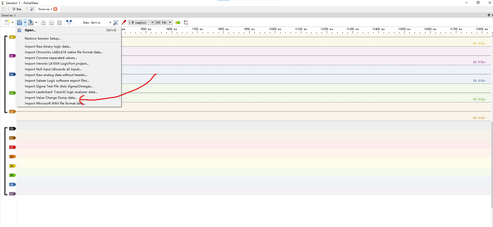

打开生成的vcd文件
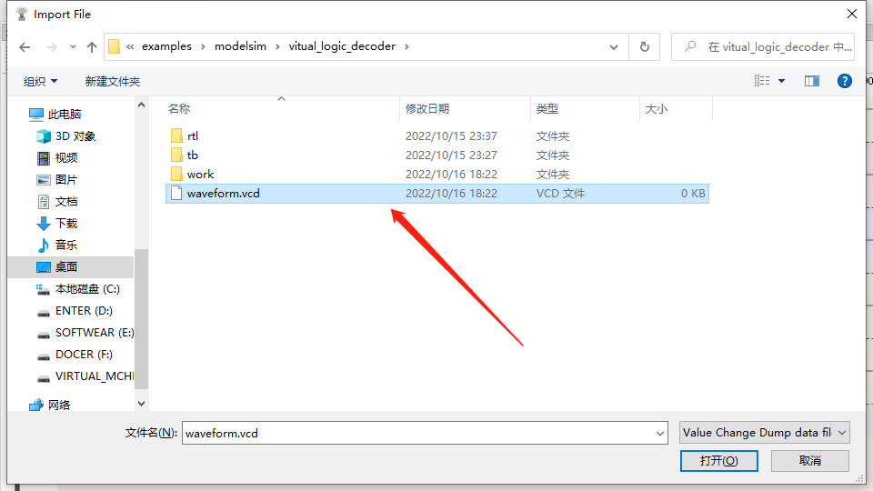

参数设置,可以不用管

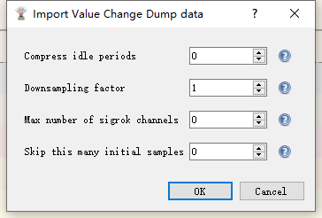

点击OK后，即可成功加载波形
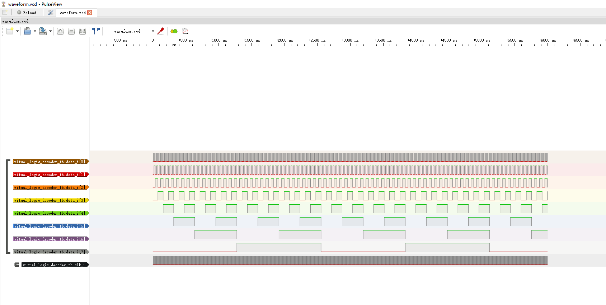

#### 波形解码
编写一个串口发送Hello world！字符串的Verilog程序，按照上述方法进行仿真生成vcd文件，使用pulseview加载后如下图所示。
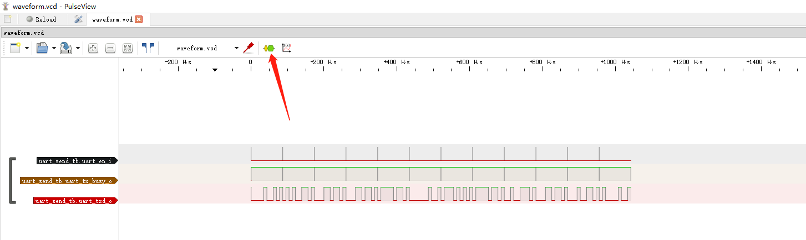

点击箭头所指，打开解码器库界面，搜索UART，并双击UART解码器添加到波形图中。

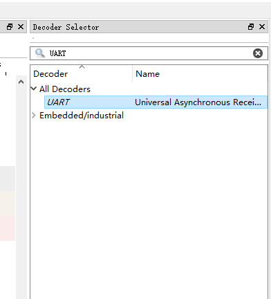

点击波形图中的UART解码器，根据自己的设计选择需要解码的通道，设置波特率等参数，选择数据显示格式为ASCII，选择完成后会自动重新解码。
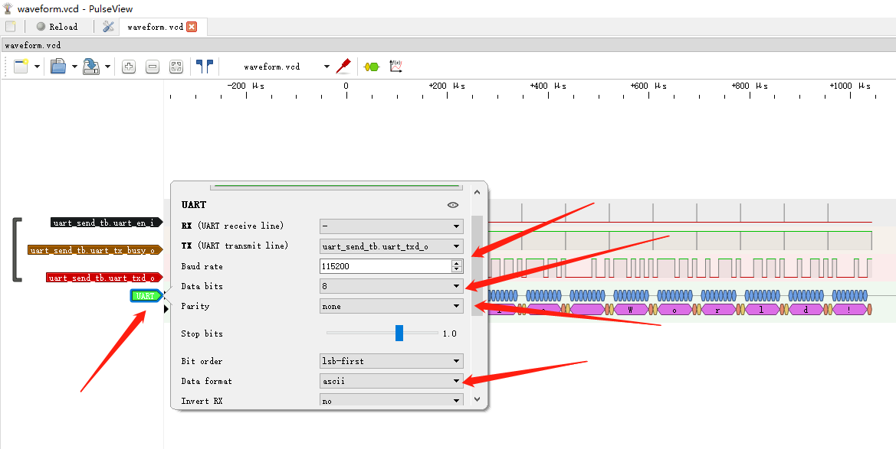

解码完成后显示正确的解码结果。
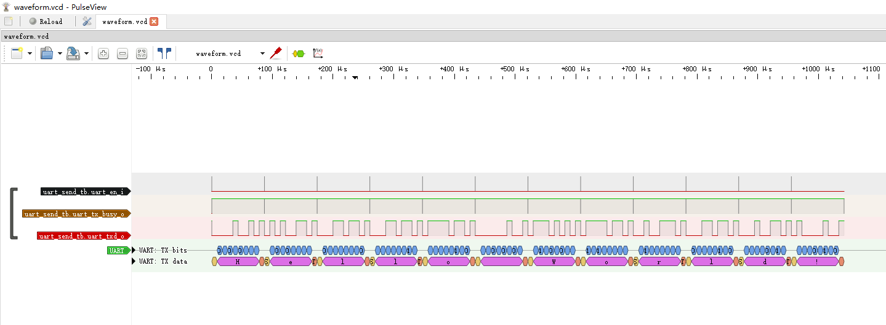

#### 其它功能
解码器按钮右边的“Math”按钮可以支持对通道使用数学表达式进行多种算术逻辑运算，可以实现很多一般数字逻辑设计波形查看器不能实现的功能。
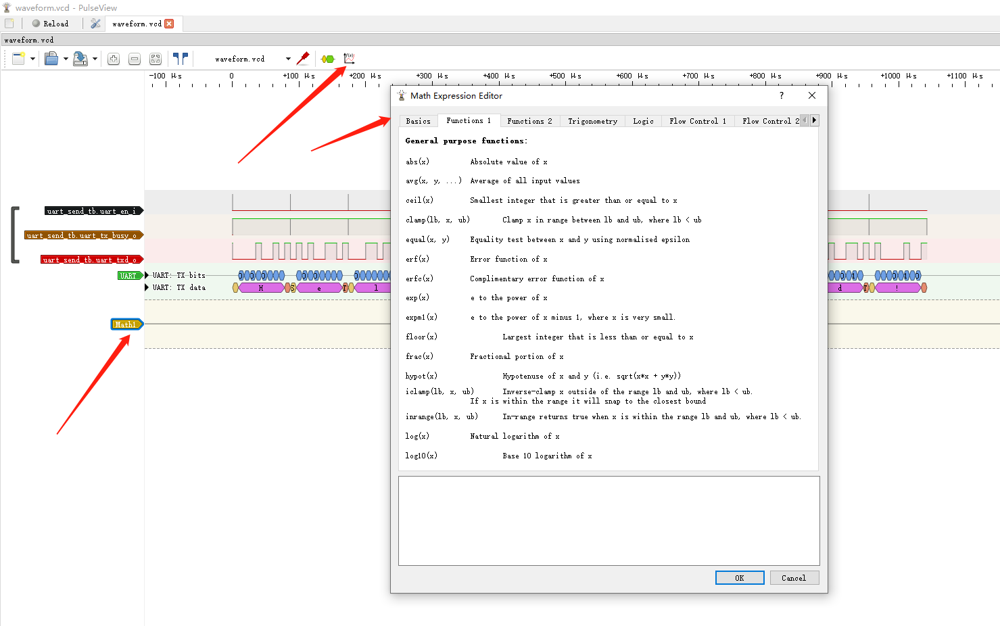

#### 提升解码性能技巧
在解码或加载仿真时间单位小或是仿真时间长的vcd波形时，pulseview软件需要执行比较长的时间，执行时间和CPU性能有关。
可以通过在Testbench设计中的timescale降低仿真精度，或者是减少仿真时间，避免过多的无用波形产生。这方面读者可以自行发挥。
#### 备注
Windows下Modelsim仿真过程中，仿真器会占用vcd文件导致pulseview无法加载（打开VCD文件时卡死），暂未找到解决办法。关闭Modelsim软件再加载vcd波形就行。不知有没更好解决办法。

重新仿真后，不需要点击open按钮重新打开vcd文件，点击软件左上角的reload按钮即可自动重新加载波形并解码，无需重新设置。
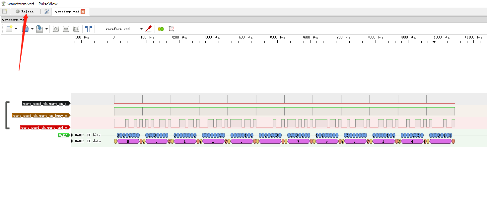

## Linux平台
### 软件安装
Linux下pulseview软件无需安装，到官网  https://sigrok.org/wiki/Downloads 下载Linux的执行文件，用chmod 777 赋予可执行权限后直接运行即可。
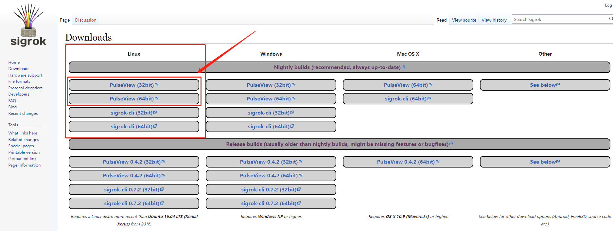

### 仿真，波形显示和解码
剩下的操作和Windows平台相同，只不过是使用的仿真软件不同而已，参考源码中给了VCS工程例程。